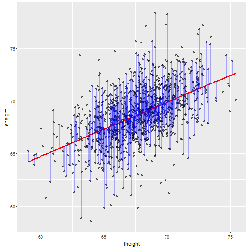

Data Products Final Presentation
========================================================
author: Brian Wang              
date: Fri Apr 01 22:29:34 2016

Introduction of My ShinyApp
========================================================

My ShinyApp is about finding the linear relationship between 1078 observations of father and son's height collected by Pearson to invesigate regression. The data set can be loaded as following code.

    library(UsingR)
    data(father.son)


```
   fheight  sheight
1 65.04851 59.77827
2 63.25094 63.21404
```
The relationship can be formed as **$son's\,height = b_0 + b_1 \times father's\,height$**

where $b_0$ is intercept, $b_1$ is coefficient or slope of the regression line.

Scatter Plot of Pearson's Data Set and Its Linear Fit
========================================================

The Sum of Squared Error($SSE$) is the squared sum of distance from all points to its regression line.



Finding Optimal Linear Fit - Least SSE
========================================================

To find optimal coefficient or slope of the line, we need to find it with the least $SSE$, which is the smallest sum of distance from all points to the line.
$$SSE = \sum_{i=0}^m(y_i - (b_0 + b_1x_i))^2$$
$$J = \frac{1}{2m} \sum_{i=0}^m(y_i - (b_0 + b_1x_i))^2 \Rightarrow J = \frac{1}{2m}SSE$$
where $m$ is the number of observation; $y_i$ and $x_i$ are actual son and father's height; $\hat y_i = b_0 + b_1x_i$ is the prediction on the regression line; $J$ is the Cost function, which would be also the least, if the least $SSE$ is found. 

More information about Cost function J: https://en.wikipedia.org/wiki/Artificial_neural_network

Play with My ShinyApp
========================================================

Use **Slope Slider** to find the least $SSE$ and $J$ to obtain optimal linear fit, and type in what you find in the **Slope:** box to check its correctness.
Link: https://by1108229.shinyapps.io/Gradient_Descent/


